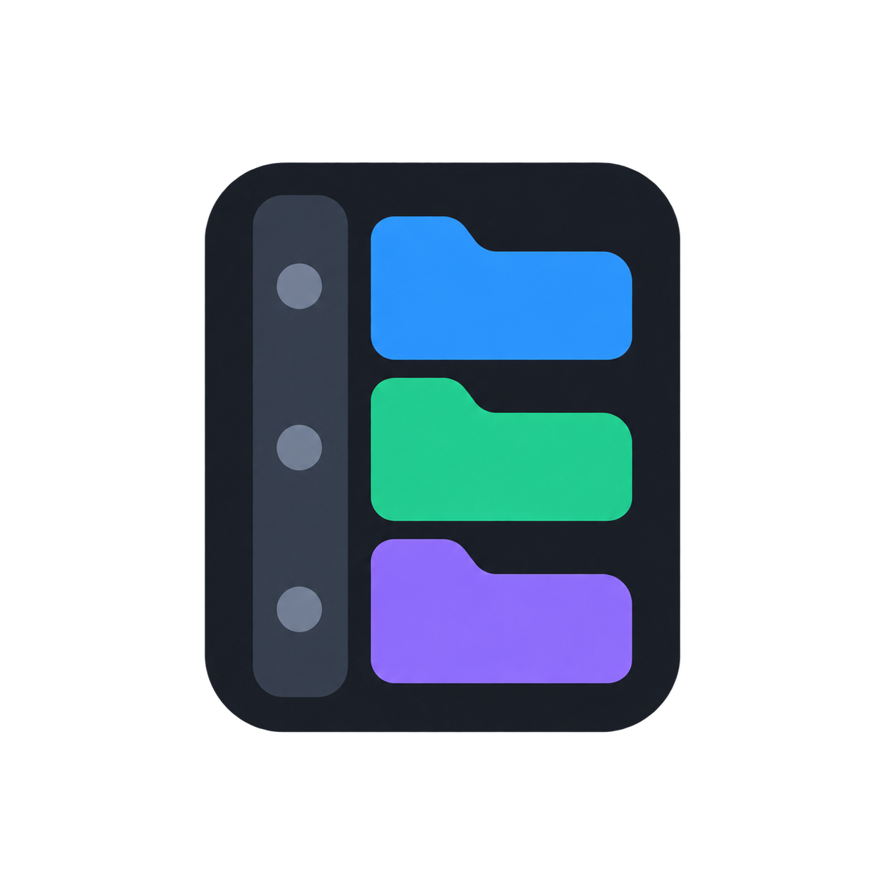
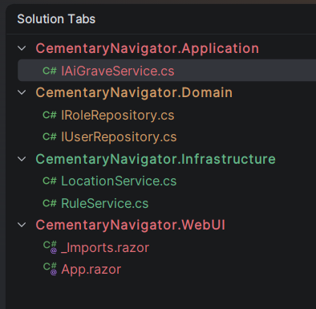

# Vertical Tabs

<p align="center">
  
</p>

Vertical Tabs is an open-files navigator for JetBrains IDEs. It docks on the left side of the IDE,
groups files by their owning IDE module or .NET project, and gives each group a consistent color. It can replace the IDE's
native editor tab bar while preserving normal editor behavior.

<p align="center">
  
</p>

## Features

- **Vertical Tabs** tool window docked on the left side of the IDE.
- Visual Studio-style grouping by the nearest `.csproj`, `.fsproj`, or `.vbproj` file.
- Generic module and content-root grouping in IntelliJ IDEA, WebStorm, PyCharm, GoLand, CLion, RubyMine, PhpStorm, and other IntelliJ Platform IDEs.
- Files outside an MSBuild project are placed in their `.sln` or `.slnx` solution group.
- Custom glob rules such as `*.cs` or `*/Tests/*.cs`; separate multiple patterns with `;`.
- One stable color for every group or project, independent of file extension.
- Configurable single-click or double-click file activation.
- Alphabetical, recently used, recently opened, or oldest-opened file ordering.
- Alphabetical, recently used, or custom-rule-priority group ordering.
- Configurable file icons, extensions, close buttons, and full-path tooltips.
- Rules can be added, removed, edited, and reordered to control their priority.
- Close files with the `×` button, middle mouse button, or context menu.
- Context-menu commands for closing one file, other files, an entire group, or all files.
- Native editor tabs can be hidden automatically and restored from the plugin settings.
- Settings are stored separately for each solution in `.idea/solutionTabs.xml`.
- Minimum supported IntelliJ Platform version: build 261. No upper build limit is declared.

## Installation

1. Download the plugin ZIP without extracting it.
2. In your JetBrains IDE, open **Settings → Plugins**.
3. Select **⚙ → Install Plugin from Disk**.
4. Select the ZIP and restart Rider when prompted.
5. Open **View → Tool Windows → Vertical Tabs**.

## Configuration

Open **Settings → Editor → Vertical Tabs**.

The settings page controls grouping, file and group ordering, activation behavior, display options,
native editor tabs, and custom rules. Rules are evaluated from top to bottom; the first matching rule wins.
Colors are applied only inside the Vertical Tabs panel.

## Building from Source

Requirements:

- OpenJDK 25
- Gradle 9.x, or the included Gradle Wrapper

Build the distributable plugin:

```powershell
./gradlew.bat buildPlugin
```

The installable ZIP is created in `build/distributions/`.

Run a development IDE instance:

```powershell
./gradlew.bat runIde
```

Validate the plugin descriptor and archive structure:

```powershell
./gradlew.bat verifyPluginStructure
```

## Compatibility Notes

The plugin is compiled against IntelliJ Platform build 261. The descriptor intentionally has no upper build limit,
so newer IDE versions may allow installation. Major IntelliJ Platform API changes can still require a
plugin update even when installation is permitted.

## Creating a GitHub Release

The repository includes a GitHub Actions release workflow. Update the version in `build.gradle.kts`,
commit the change, and push a matching tag:

```bash
git tag v0.5.5
git push origin v0.5.5
```

The workflow runs the tests and plugin validation, builds the distribution, creates a GitHub Release,
generates release notes, and attaches the installable ZIP. The tag must exactly match the plugin version.

## License

Vertical Tabs is open-source software available under the [MIT License](LICENSE).
